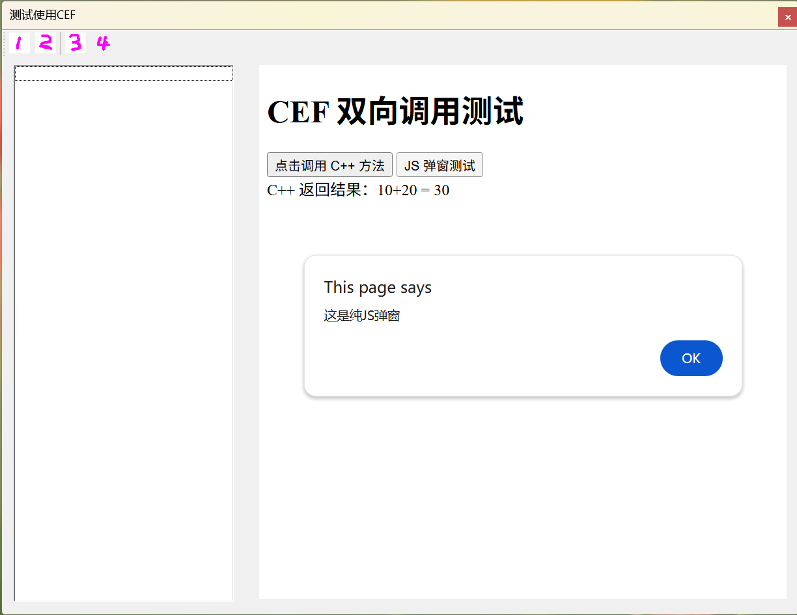
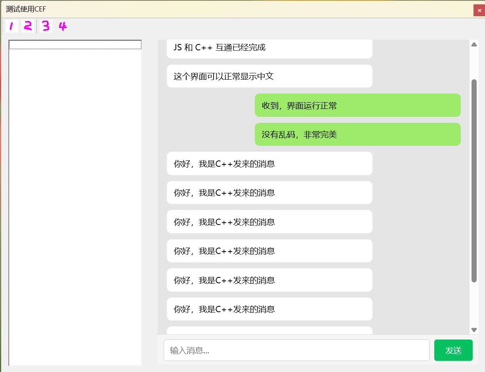

# 一、准备

## 1.1 版本

下载地址：https://cef-builds.spotifycdn.com/index.html

我使用的是：cef_binary_146.0.11+g3a0fcf1+chromium-146.0.7680.179_windows64.tar.bz2

## 1.2 编译示例

我使用的是visual studio 2026 社区版

进入根目录后，比如我的，ef_binary_146.0.11，执行命令生成VS的解决方案文件：

```
cmake -G "Visual Studio 17 2022" -A x64 -T v145 
```

得到cef.sln

需要编译`libcef_dll_wrapper`和`cefsimple`，这是为了得到一个可以用的资源环境，


备注：

1. 注意，我这里是用的调试版本， MDd链接方式，需要自己改一下；`项目属性-> c++ > 代码生成`

2. 库使用的UTF-8编码，需要在VS的： `项目属性-> c++ > 命令行`中添加： `/utf-8`

3. 编译我是使用的C++20标准；`项目属性-> c++ > 语言`

4. 编译cefsimple成功后，可以运行测试程序，那么这个`cef_binary_146.0.11\tests\cefsimple\Debug`

   就是一个能运行的环境了；一会我们自己的程序也需要里面的动态库和资源；

   因为：官方包里解开的debug里面给的不能直接运行，我也懒得追究缺啥，谁可以答复一下？

# 二、对话框测试程序

测试源码地址：https://github.com/robinfoxnan/cef_mfc_dialog

运行的效果如下：


<br>

测试程序在;
mfsTestCef\x64\Debug，但是DLL实在太大了，GITHUB不让传


这里需要总结几点：

1. 类simple_app基本是按照示例代码改的。但是去掉了委托窗口，使用本地模式，自己创建窗口；

2. 类simple_hander也是示例中改的，添加了几个基类，用于自定义右键菜单；

3. 预编译文件头需要添加几行代码，否则会冲突

   ```c++
   // 必须放在 stdafx.h 第一行！
   #define NOMINMAX
   #undef max
   #undef min
   
   ```

4. 程序入口处进行初始化：mfsTestCef.cpp，这里需要把对话框改为非模式框，然后启动消息循环：

   ```c++
   
   BOOL CmfsTestCefApp::InitInstance()
   {
   	// 如果应用程序存在以下情况，Windows XP 上需要 InitCommonControlsEx()
   	// 使用 ComCtl32.dll 版本 6 或更高版本来启用可视化方式，
   	//则需要 InitCommonControlsEx()。  否则，将无法创建窗口。
   	INITCOMMONCONTROLSEX InitCtrls;
   	InitCtrls.dwSize = sizeof(InitCtrls);
   	// 将它设置为包括所有要在应用程序中使用的
   	// 公共控件类。
   	InitCtrls.dwICC = ICC_WIN95_CLASSES;
   	InitCommonControlsEx(&InitCtrls);
   
   	CWinApp::InitInstance();
   
   
   	AfxEnableControlContainer();
   
   	// 创建 shell 管理器，以防对话框包含
   	// 任何 shell 树视图控件或 shell 列表视图控件。
   	CShellManager *pShellManager = new CShellManager;
   
   	// 激活“Windows Native”视觉管理器，以便在 MFC 控件中启用主题
   	CMFCVisualManager::SetDefaultManager(RUNTIME_CLASS(CMFCVisualManagerWindows));
   
   	// 标准初始化
   	// 如果未使用这些功能并希望减小
   	// 最终可执行文件的大小，则应移除下列
   	// 不需要的特定初始化例程
   	// 更改用于存储设置的注册表项
   	// TODO: 应适当修改该字符串，
   	// 例如修改为公司或组织名
   	SetRegistryKey(_T("应用程序向导生成的本地应用程序"));
   
   	// ======================== 正确 CEF 初始化 ========================
   	HINSTANCE hInstance = AfxGetInstanceHandle();
   	void* sandbox_info = nullptr;
   	CefMainArgs main_args(hInstance);
   
   	// ✅ 1. 先创建 app
   	
   
   	CefRefPtr<CefCommandLine> command_line = CefCommandLine::CreateCommandLine();
   	command_line->InitFromString(::GetCommandLineW());
   
   	//command_line->AppendSwitch("single-process");  // 如果需要调试
   	command_line->AppendSwitch("no-sandbox");
   	command_line->AppendSwitch("disable-gpu");
   	command_line->AppendSwitch("disable-win32k-lockdown");
   	command_line->AppendSwitchWithValue("device-auth-disabled", "1");
   	command_line->AppendSwitchWithValue("allow-running-insecure-content", "1");
   	command_line->AppendSwitch("--use-alloy-style");
   
   	app = new SimpleApp();
   
   	// ✅ 2. 只调用一次 CefExecuteProcess，必须传 app！！！
   	int exit_code = CefExecuteProcess(main_args, app, sandbox_info);
   	if (exit_code >= 0) {
   		return FALSE;
   	}
   
   	// CEF 设置
   	CefSettings settings;
   	settings.no_sandbox = true;
   	settings.multi_threaded_message_loop = false;
   	settings.windowless_rendering_enabled = false;
   	//settings.remote_debugging_port = 9222;
   
   	// ✅ 3. 初始化，传入 app
   	CefInitialize(main_args, settings, app, sandbox_info);
   
   	
   
   	////////////////////////////////////////////
   	// 3. **先创建对话框，再显示**
   	CmfsTestCefDlg dlg;
   	m_pMainWnd = &dlg;
   	
   	//dlg.MyDoModal();
   	//dlg.DoModal();
   
   	
   	//MSG msg;
   	//while (GetMessage(&msg, NULL, 0, 0))
   	//{
   	//	TranslateMessage(&msg);
   	//	DispatchMessage(&msg);
   
   	//	// 让 CEF 跑一帧（必须加！）
   	//	CefDoMessageLoopWork();
   	//}
   
   	dlg.Create(IDD_MFSTESTCEF_DIALOG);
   	dlg.ShowWindow(SW_SHOW);
   	CefRunMessageLoop();
   
   	
   
   #if !defined(_AFXDLL) && !defined(_AFX_NO_MFC_CONTROLS_IN_DIALOGS)
   	ControlBarCleanUp();
   #endif
   
   	// 由于对话框已关闭，所以将返回 FALSE 以便退出应用程序，
   	//  而不是启动应用程序的消息泵。
   
   	// ========================
   	
   	CefShutdown();
   	// ========================
   
   	// 删除上面创建的 shell 管理器。
   	if (pShellManager != nullptr)
   	{
   		delete pShellManager;
   	}
   
   	return FALSE;
   }
   ```

   

5. 在对话框初始化时候，用一个static控件占位，然后在这个位置添加浏览器控件；

   ```c++
   
   BOOL CmfsTestCefDlg::OnInitDialog()
   {
   	CDialogEx::OnInitDialog();
   
   	// ✅✅✅ 就这三行，加在最前面！！！
   	ModifyStyle(DS_MODALFRAME, 0);
   	ModifyStyle(0, WS_MINIMIZEBOX | WS_MAXIMIZEBOX | WS_SYSMENU);
   	SetWindowPos(NULL, 0, 0, 0, 0, SWP_NOMOVE | SWP_NOSIZE | SWP_NOZORDER | SWP_FRAMECHANGED);
   	// ==============================================
   	// ✅【必须放在第一行！】先设置样式，再初始化其他！
   	// ==============================================
   	//LONG_PTR style = GetWindowLongPtr(m_hWnd, GWL_STYLE);
   	//style |= WS_SYSMENU | WS_MINIMIZEBOX | WS_MAXIMIZEBOX;
   	//SetWindowLongPtr(m_hWnd, GWL_STYLE, style);
   	SetWindowPos(NULL, 0, 0, 0, 0, SWP_NOMOVE | SWP_NOSIZE | SWP_NOZORDER | SWP_FRAMECHANGED);
   
   	// 下面的代码 完全不动！
   	CDialogEx::OnInitDialog();
   
   	// 【已经注释】// ModifyStyle(0, WS_CLIPCHILDREN);
   
   	ASSERT((IDM_ABOUTBOX & 0xFFF0) == IDM_ABOUTBOX);
   	ASSERT(IDM_ABOUTBOX < 0xF000);
   
   	CMenu* pSysMenu = GetSystemMenu(FALSE);
   	if (pSysMenu != nullptr)
   	{
   		BOOL bNameValid;
   		CString strAboutMenu;
   		bNameValid = strAboutMenu.LoadString(IDS_ABOUTBOX);
   		ASSERT(bNameValid);
   		if (!strAboutMenu.IsEmpty())
   		{
   			pSysMenu->AppendMenu(MF_SEPARATOR);
   			pSysMenu->AppendMenu(MF_STRING, IDM_ABOUTBOX, strAboutMenu);
   		}
   	}
   
   	SetIcon(m_hIcon, TRUE);
   	SetIcon(m_hIcon, FALSE);
   
   	if (!m_wndToolBar.CreateEx(this, TBSTYLE_FLAT, WS_CHILD | WS_VISIBLE | CBRS_TOP | CBRS_GRIPPER | CBRS_TOOLTIPS | CBRS_FLYBY | CBRS_SIZE_DYNAMIC) ||
   		!m_wndToolBar.LoadToolBar(IDR_TOOLBAR1))
   	{
   		TRACE0("创建工具条失败\n");
   	}
   	m_wndToolBar.SetSizes(CSize(40, 40), CSize(32, 32));
   	m_wndToolBar.SetBarStyle(m_wndToolBar.GetBarStyle() | CBRS_TOOLTIPS | CBRS_FLYBY);
   	RepositionBars(AFX_IDW_CONTROLBAR_FIRST, AFX_IDW_CONTROLBAR_LAST, 0);
   
   	// ============ 嵌入 CEF ============
   	CmfsTestCefApp* app = dynamic_cast<CmfsTestCefApp*>(AfxGetApp());
   	if (app != NULL) {
   		CRect rc;
   		mContainer.GetClientRect(&rc);
   		app->app->createWindow(mContainer.GetSafeHwnd(), rc, "d:\\obuild\\cef_test.html");
   		bInited = true;
   	}
   
   	return TRUE;
   }
   ```

   

6. 关闭时候程序的流程是这样的：

   - 对话框onClose，调用hander 关闭窗口
   - hander =>doClose告诉浏览器控件发一个WM_CLOSE；
   - 对话框再次回到了onClose，这次需要销毁窗口；才能退出；
   - hander => onBeforeClose 会执行退出循环；
   - 然后回到主程序的代码处，销毁控件；


# 三、测试网页

我让豆包写了2个测试页面，一个是简单测试一下交互功能，另一个是简单的做一个聊天界面的直观的情况；

cef_test.html

```html
<!DOCTYPE html>
<html>
<head>
    <meta charset="utf-8">
    <title>CEF JS ↔ C++ 测试</title>
</head>
<body>
    <h1>CEF 双向调用测试</h1>

    <button onclick="testCallCpp()">点击调用 C++ 方法</button>
    <button onclick="showMessage()">JS 弹窗测试</button>
    <div id="result"></div>

    <script>
        // JS 调用 C++
        function testCallCpp() {
            try {
                // 调用 C++ 注册的方法
                var ret =  window.native.add(10, 20);
                document.getElementById("result").innerHTML = 
                    "C++ 返回结果：10+20 = " + ret;
            } catch (e) {
                document.getElementById("result").innerHTML = "错误：" + e.message;
            }
        }

        // 普通JS方法
        function showMessage() {
            alert("这是纯JS弹窗");
        }

        // 提供给C++调用的JS方法
        function showMsgFromCpp(msg) {
            alert("C++ 调用 JS：" + msg);
            document.getElementById("result").innerHTML = 
                "C++ 调用了JS方法，消息：" + msg;
        }
		
		function showMsgFromCppJson(jsonObj) {
			alert("C++ 调用 JS\n姓名：" + jsonObj.name + "\n年龄：" + jsonObj.age);
			
			document.getElementById("result").innerHTML = 
				"C++ 传入JSON：<br>" +
				"姓名：" + jsonObj.name + "<br>" +
				"年龄：" + jsonObj.age;
		}
    </script>
</body>
</html>


```

cef_chat.html

```html
<!DOCTYPE html>
<html lang="zh-CN">
<head>
    <meta charset="UTF-8">
    <title>微信风格聊天界面</title>
    <style>
        * {
            margin: 0;
            padding: 0;
            box-sizing: border-box;
            font-family: "Microsoft YaHei", Arial, sans-serif;
        }

        body {
            background-color: #E5E5E5;
            display: flex;
            flex-direction: column;
            height: 100vh;
        }

        /* 消息区域 */
        #messageArea {
            flex: 1;
            padding: 15px;
            overflow-y: auto;
        }

        /* 气泡 */
        .bubble {
            max-width: 70%;
            margin-bottom: 10px;
            padding: 9px 12px;
            border-radius: 8px;
            font-size: 14px;
            line-height: 1.5;
            word-break: break-all;
        }

        /* 左边（别人/C++） */
        .left {
            background: white;
            align-self: flex-start;
        }

        /* 右边（自己） */
        .right {
            background: #9EEA6A;
            align-self: flex-end;
            margin-left: auto;
        }

        /* 底部输入栏 - 强制显示 */
    .inputBox {
        height: 52px;
        background: #F5F5F5;
        display: flex;
        align-items: center;
        padding: 0 10px;
        border-top: 1px solid #ddd;
        flex-shrink: 0; /* 关键：不让输入框被挤压消失 */
    }

        #inputText {
            flex: 1;
            height: 36px;
            border: 1px solid #ccc;
            border-radius: 4px;
            padding: 0 10px;
            font-size: 14px;
            outline: none;
        }

        #sendBtn {
            width: 65px;
            height: 36px;
            margin-left: 8px;
            background: #07C160;
            color: white;
            border: none;
            border-radius: 4px;
            cursor: pointer;
        }
    </style>
</head>

<body>
    <div id="messageArea"></div>

    <div class="inputBox">
        <input type="text" id="inputText" placeholder="输入消息...">
        <button id="sendBtn">发送</button>
    </div>

    <script>
        const area = document.getElementById('messageArea');
        const input = document.getElementById('inputText');
        const btn = document.getElementById('sendBtn');

        // 添加一条消息
        function addMsg(text, side) {
            let div = document.createElement('div');
            div.className = 'bubble ' + side;
            div.innerText = text;
            area.appendChild(div);
            area.scrollTop = area.scrollHeight;
        }

        // 供C++调用
        function showMsgFromCpp(msg) {
            addMsg(msg, 'left');
        }

        // 发送
        function send() {
            let txt = input.value.trim();
            if (!txt) return;
            addMsg(txt, 'right');
            input.value = '';

            // 发给C++
            try {
                window.native.onSendMessage(txt);
            } catch (e) {}
        }

        btn.onclick = send;
        input.onkeydown = function (e) {
            if (e.key === 'Enter') send();
        };

        // ==============================
        // 初始化默认消息
        // ==============================
        addMsg('你好！', 'left');
        addMsg('JS 和 C++ 互通已经完成', 'left');
        addMsg('这个界面可以正常显示中文', 'left');
        
        addMsg('收到，界面运行正常', 'right');
        addMsg('没有乱码，非常完美', 'right');

    </script>
</body>
</html>
```


# 四、完成效果与遗留的问题

## 4.1 功能

1. 能打开网页了；
2. 能实现c++给JS传递数据；
3. 能实现JS调用C++功能；
4. 右键菜单自己定义；

## 4.2 存在的问题

1. 对话框的按钮被改了，不知道如何调整；
2. 风格必须使用原生模式，否则不能自定义菜单；
3. 原生模式无法执行调试窗口；F12没有用；